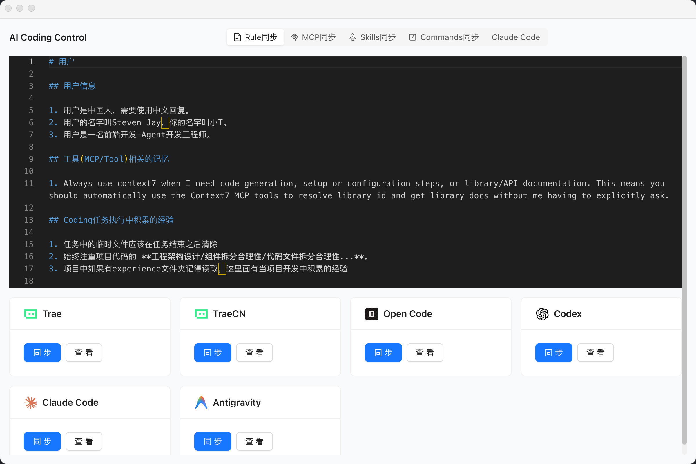
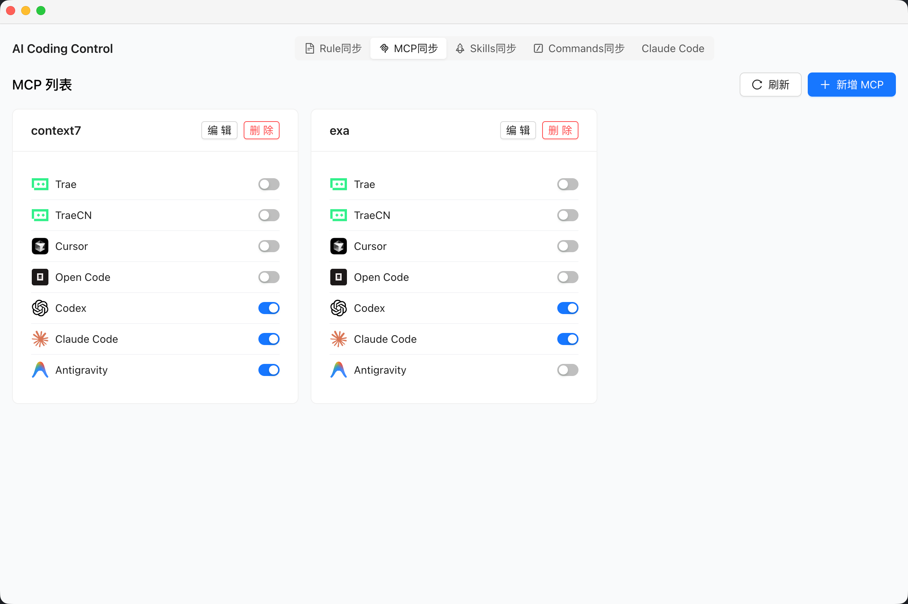
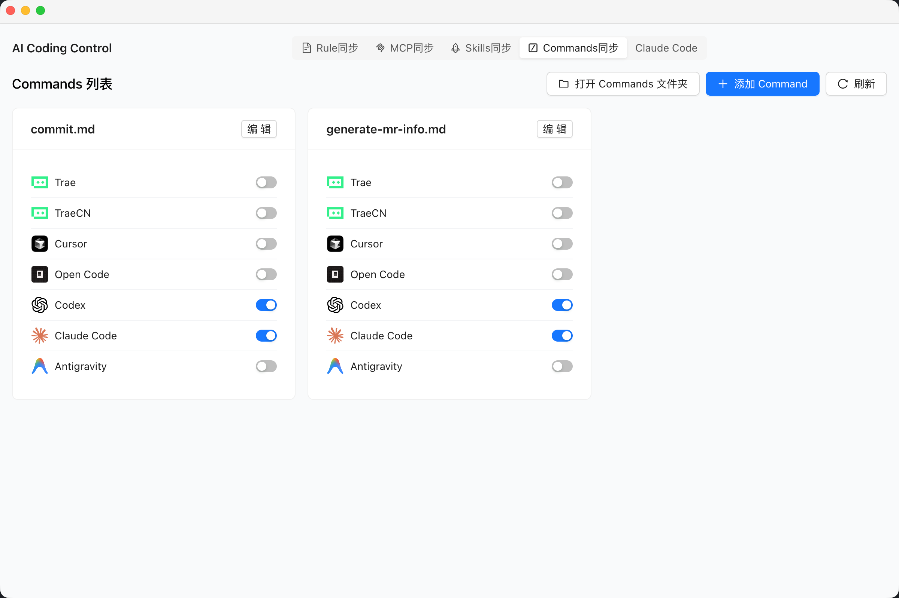

<p align="right">
  <a href="README.md">中文</a> | <a href="README_EN.md">English</a>
</p>

<p align="center">
  
</p>

<h1 align="center">AI Coding Control</h1>

<p align="center">
  A desktop app for centrally managing and syncing configurations across multiple AI coding assistants.
</p>

---

If you use more than one AI coding tool (Claude Code, Cursor, Trae, Codex, etc.), you know the pain of keeping rules, MCP servers, skills, and commands in sync. **AI Coding Control** provides a unified visual interface to manage them all in one place.

## Features

- **Rule Sync** — Write your coding rules once, sync to all tools (CLAUDE.md, AGENTS.md, user_rules.md, etc.)

  

- **MCP Sync** — Visually manage MCP (Model Context Protocol) server configs with per-tool toggles

  

- **Skills Sync** — Copy skill packages between tools with one click

  

- **Commands Sync** — Keep custom commands consistent across all AI assistants

  

- **Visual Editor** — Built-in Monaco editor for editing rules and configs directly
- **ClaudeCode Quick Config** — One-click bypass Plugin login, quickly edit settings.json and .claude.json

  

- **Extensible** — Add custom AI tools via configuration

## Supported Tools

| Tool | Rules | MCP | Skills | Commands |
|------|:-----:|:---:|:------:|:--------:|
| [Trae](https://www.trae.ai/) | ✅ | ✅ | ✅ | ✅ |
| TraeCN | ✅ | ✅ | ✅ | ✅ |
| [Cursor](https://cursor.sh/) | — | ✅ | ✅ | ✅ |
| [OpenCode](https://opencode.ai/) | ✅ | ✅ | ✅ | ✅ |
| [Codex](https://github.com/openai/codex) | ✅ | ✅ | ✅ | ✅ |
| [Claude Code](https://docs.anthropic.com/en/docs/claude-code) | ✅ | ✅ | ✅ | ✅ |
| [Antigravity](https://codeium.com/) | ✅ | ✅ | ✅ | ✅ |

## Tech Stack

- **Electron** — Cross-platform desktop app
- **React 18** + **TypeScript** — UI framework
- **Vite** — Build tool
- **Ant Design** — UI component library
- **Monaco Editor** — Code editor (same as VS Code)
- **Tailwind CSS** + **Sass** — Styling

## Getting Started

### Prerequisites

- [Node.js](https://nodejs.org/) >= 18
- [pnpm](https://pnpm.io/)

### Install

```bash
git clone https://github.com/your-username/ai-coding-control.git
cd ai-coding-control
pnpm install
```

### Development

```bash
# Start both frontend and Electron (recommended)
pnpm run dev

# Frontend only
pnpm run dev:react

# Electron only
pnpm run dev:electron
```

### Build

```bash
# Full build (frontend + Electron packaging)
pnpm run build

# Frontend only
pnpm run build:react

# Electron packaging only
pnpm run build:electron
```

## Project Structure

```
ai-coding-control/
├── electron/              # Electron main process
│   ├── main.cjs           # Main entry (window management, IPC, file ops)
│   └── preload.cjs        # Preload script (secure API bridge)
├── src/                   # React frontend source
│   ├── components/        # Shared components (CodeEditor, Header, etc.)
│   ├── hooks/             # Custom hooks
│   ├── pages/             # Pages
│   │   ├── RuleSync/      # Rule sync
│   │   ├── McpSync/       # MCP sync
│   │   ├── SkillsSync/    # Skills sync
│   │   └── CommandsSync/  # Commands sync
│   ├── router/            # Route config
│   ├── types/             # TypeScript type definitions
│   └── styles/            # Global styles
├── build/                 # Build resources (icons, etc.)
└── package.json
```

## Configuration

App data is stored in `~/.ai-coding-control/`:

- `ai_coding_tools.json` — AI tool config list (customizable)
- `AGENTS.md` — Local rule file
- `mcp.json` — MCP server configurations

### Adding Custom Tools

Edit `~/.ai-coding-control/ai_coding_tools.json` to add a new tool:

```json
{
  "id": "my-tool",
  "name": "My AI Tool",
  "ruleTargetPath": "~/.my-tool/rules.md",
  "mcpConfigPath": "~/.my-tool/mcp.json",
  "mcpConfigKey": "mcpServers",
  "mcpFormat": "json",
  "skillsPath": "~/.my-tool/skills",
  "commandsPath": "~/.my-tool/commands"
}
```

## Contributing

Contributions are welcome! Feel free to open issues and pull requests.

1. Fork the repository
2. Create a feature branch (`git checkout -b feat/amazing-feature`)
3. Commit your changes (`git commit -m 'feat: add amazing feature'`)
4. Push to the branch (`git push origin feat/amazing-feature`)
5. Open a Pull Request

## License

[MIT](LICENSE)
